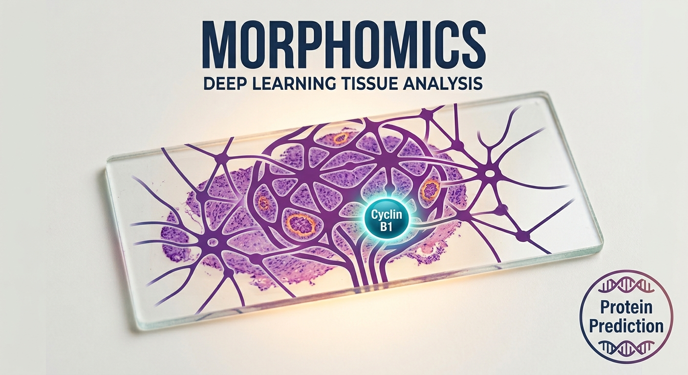

<p align="center">
  
</p>

<h1 align="center">Cervical Cancer Virtual Protein Profiling</h1>

<p align="center">
  <em>Predicting cancer-related protein expression from routine H&amp;E slides,
  to bring precision diagnostics to low-resource labs.</em>
</p>

---

## The problem

Cervical cancer is one of the leading causes of cancer death among women in South Africa.
Molecular tests that guide treatment, such as PD-L1 testing for immunotherapy, are expensive
and scarce in public hospitals. Every patient, however, already has a routine H&amp;E-stained
tissue slide.

## What this project does

We train a deep learning model to read a standard H&amp;E slide and predict whether key
proteins are high or low, with heatmaps showing which tissue regions drove each prediction.
The tool is designed to help pathology labs **flag which patients most need confirmatory
molecular testing**. It supports, and does not replace, laboratory tests.

**Protein panel**

| Protein | Why it matters |
| --- | --- |
| PD-L1 | Eligibility for immunotherapy |
| p16 | Marker of HPV-driven disease |
| Cyclin B1 | Proliferation and tumour aggressiveness |
| Phospho-Rb | HPV E7's disruption of the Rb tumour suppressor |
| E-cadherin | Cell cohesion; loss suggests invasion |

## How it works

```
H&E whole-slide image
  -> tissue detection and 256 x 256 px patches at 20x
  -> frozen pathology foundation model (Phikon) -> one feature vector per patch
  -> multi-task attention MIL model -> High/Low probability per protein
  -> attention heatmaps and top patches for each protein
```

- **Data:** 145 TCGA-CESC patients with both a diagnostic H&amp;E slide and reverse-phase
  protein array (RPPA) data from the [NCI Genomic Data Commons](https://portal.gdc.cancer.gov/).
- **Labels:** each protein is split at the cohort median into High and Low.
- **Evaluation:** patient-level 5-fold cross-validation, AUC with 95% confidence intervals,
  a mean-pooling baseline, and a permutation test against shuffled labels.

## Repository layout

```
main.py                       FastAPI backend (predictions + demo cases)
preprocessing/process.py      patch preprocessing for the API
scripts/prepare_data.py       find matched patients, build slide manifest, protein matrix
scripts/download_slides.sh    download slides with gdc-client
scripts/extract_features.py   tile slides and extract patch features (GPU)
scripts/train.py              baseline + attention model, cross-validation, metrics
scripts/make_demo_cases.py    heatmaps, top patches and result.json for the UI
environment.yml               full cluster environment (GPU)
requirements-api.txt          lightweight laptop environment (API and UI)
```

## Quick start (cluster)

```bash
conda env create -f environment.yml && conda activate vpp   # or a venv; see check_env.py
python scripts/prepare_data.py --out data                   # matched patients + protein data
bash scripts/download_slides.sh slides/                     # ~148 GB of slides
sbatch scripts/extract_features.sh slides/ phikon           # patch features
sbatch scripts/train.sh phikon                              # train + evaluate
python scripts/make_demo_cases.py --results results/phikon \
    --features features/phikon --slides slides/ --n 3       # demo cases for the UI
```

## Run the API (laptop)

```bash
pip install -r requirements-api.txt
uvicorn main:app --reload
# open http://127.0.0.1:8000/docs
```

## Limitations

- Trained on TCGA slides, mostly from US hospitals. Performance on South African slides,
  with different staining and scanners, has not yet been tested.
- "High" and "Low" are relative to the TCGA cohort median, not clinical cut-offs.
- RPPA measures total protein in a tissue sample; it is not the same as clinical
  immunohistochemistry scoring (for example, the PD-L1 CPS score).
- Research prototype for decision support only. Not a diagnostic device.

## Next steps

- Validate on South African slides with local pathology partners.
- Stain normalisation and domain adaptation for local labs.
- Extend the protein panel and compare pathology foundation models.

## Team

Built for the Wits Social Good Hackathon 2026.
